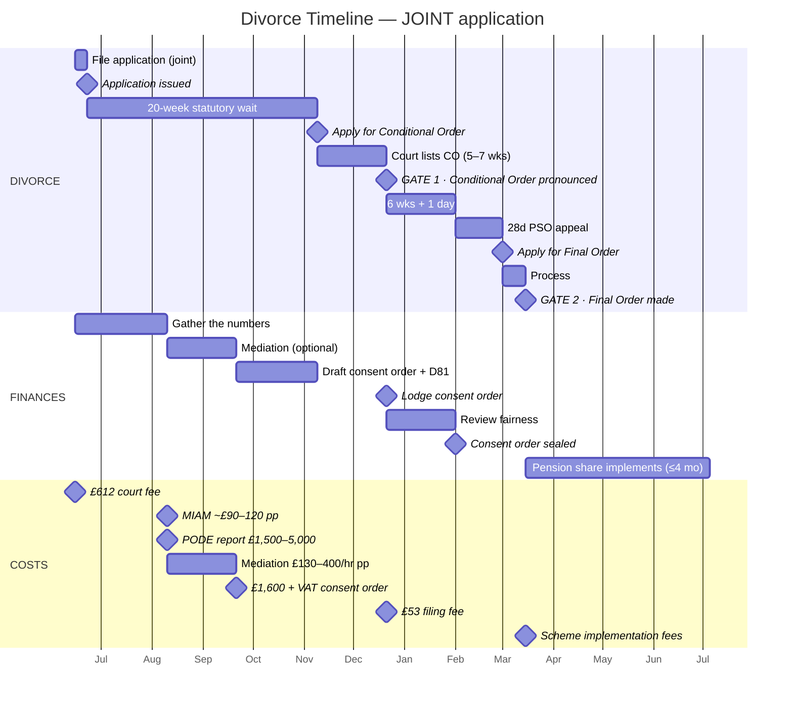
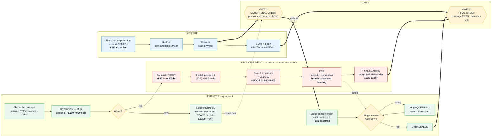

# Divorce & Financial Settlement — Process Flow (England & Wales)

**Compiled:** 2 June 2026 · **Basis:** Atkins Dellow consultation (Alan Caldwell, 2 Jun) + verification against gov.uk / family-law sources.

> Not legal advice. **This doc is about the STRUCTURE of the flow.** Cost figures are *indicative* and to be refined later — the point right now is *where* in the process money is spent, and where extra costs appear if agreement fails.

---

## The model

Two **activities run in parallel over the same period** — they are NOT either/or, and not one-after-the-other:

- **Track A — the Divorce** (ends the marriage). **Fixed. Cannot be contested** under no-fault law (a respondent can only object on narrow legal grounds — not "I don't want to" or "I dislike the split"). Track A never branches.
- **Track B — the Finances** (the consent order / clean break). This is where all the work — and the only fork — happens.

They synchronise at two **gates**: the **Conditional Order** unlocks filing the finances; the **Final Order** is the shared finish line (and should wait for the finances to be sealed).

---

## High-level overview — parallel timeline (swimlane)

Time runs **left → right**. Two lanes run **simultaneously** over the same period; the **gates** are the points where they sync. Happy path only — the contested fork lives in the detailed flow below.

> Axis is anchored to an **illustrative mid-June 2026 start**; **durations are indicative**, not commitments (statutory minimum ~26 wks; real-world average ~44 wks).

> **Two versions below — one per application route.** **JOINT** (both apply together; no acknowledgement-of-service step) is the current focus. **SOLE** (Rupert applies, Heather acknowledges) is stubbed for later. Background: [[2026-06-03_sole-vs-joint-and-solicitor-models]].

### Joint application (focus)

**Reading it:** both lanes start at the same left edge (true parallelism). The Finances *gather → mediate → draft* all happen **during** the 20-week wait. **Gate 1 (Conditional Order)** is the sync point that *unlocks lodging the finances*. **Gate 2 (Final Order)** is pushed past the bare 6-week window by the **28-day pension-share wait** — the visual reminder that the marriage end must wait for the pension split to seal. (Joint application = **no acknowledgement-of-service step**; the 20-week clock runs from the **issue** milestone.)

### Sole application (stub — build later)

Same as the joint version **plus** an **Acknowledgement of service** step: on a *sole* application Heather is the respondent and must return the AoS (~14 days). Key correctness point for when we build it: **AoS sits *concurrently inside* the early part of the 20-week wait — it does NOT delay the start.** The 20-week clock still runs from the **issue** date either way. Everything from Gate 1 onward is identical to the joint version.

*(To be drawn when Rupert turns to the sole route — see [[2026-06-03_sole-vs-joint-and-solicitor-models]].)*

---

## Swimlane flow (drill-down) — dependencies + the contested branch

Three horizontal lanes, left → right. Solid arrows = the normal route; the **bold arrows cross lanes** to show dependencies (e.g. *Gate 1 unlocks Lodge*). The **Agree?** decision is the only fork: **YES** stays in the Finances lane; **NO** drops into the Contested lane.

---

## Cost overlay (indicative — refine later)

| Where | Happy path (agree) | If you disagree (contested) |
|---|---|---|
| Divorce application | **£612** court fee (one-off) | same |
| Reaching agreement | **MIAM ~£90–120 pp** + mediation **~£130–400/hr per person** (optional), ≈⅓ of solicitor route | Solicitor time **~£300/hr** (Caldwell) once contested |
| Pensions (likely even if agreed) | **PODE report £1,500–5,000** (advisable — pensions are ⅔ of wealth + Heather has a **DB** scheme) + **scheme implementation fees** (variable, per scheme, at transfer) | same PODE, plus more if disputed |
| The financial order | Caldwell **fixed fee £1,600 + VAT** to draft consent order; **~£53** court fee to file | **~£303** Form A fee + Form E prep + **PODE £1,500–5,000** + multiple hearings + counsel; **Form H costs at every step** |
| Ballpark | low — fixed/known | **£10k–£30k+** and much slower (the ~44-wk average balloons) |

**The headline:** the happy path has a **known, capped** financial-order cost (Caldwell's fixed fee + small court fees). Disagreement replaces that fixed fee with **open-ended hourly + expert + hearing costs** — that's where the money escapes.

---

## Nomenclature (quick reference) — VERIFIED 3 Jun

### The four "Orders" — the core confusion, resolved

Four different things end in "Order", split across the two tracks. **"Conditional" (divorce) and "Consent" (finances) sound alike but are unrelated.**

| Term | Track | What it is | Old name |
|---|---|---|---|
| **Conditional Order** | **Divorce** | the *provisional* divorce decree — "conditional" = not final yet | decree nisi |
| **Final Order** | **Divorce** | ends the marriage | decree absolute |
| **Financial Remedy Order** | **Finances** | **umbrella term** for *any* court order dividing money/pensions on divorce (Alan's word; replaced "ancillary relief" in 2011) | — |
| **Consent Order** | **Finances** | a **specific type** of Financial Remedy Order — the one where the parties **agreed** the terms and the court just approves it | — |

**Genus / species:** a **Consent Order IS a Financial Remedy Order**, just the *agreed* flavour. Same category, two routes to it:

- **Agree** → Financial Remedy Order **by consent** = "Consent Order" ✅ (Rupert's goal)
- **Don't agree** → Financial Remedy Order **imposed by a judge** after contested hearings

So when Alan says "Financial Remedy Order" he means the parent category; "Consent Order" is the agreed sub-type we're aiming for. They are **not** competing terms.

### The two approval verbs (don't cross them over)

- **Conditional Order is *pronounced*** (divorce track, Gate 1) — you *apply* for it after the 20 weeks; a judge grants it on a listed date, remotely.
- **Consent Order is *sealed*** (finance track) — a judge approves it for *fairness* and stamps it binding, **only after** the Conditional Order is pronounced.

### Forms / hearings

| Plain term | Official term |
|---|---|
| Financial snapshot form (agreed route) | **Form D81** — Statement of Information for a Consent Order (what the judge reads to test fairness) |
| Opens/dismisses financial claims | **Form A** (embedded online, or "for dismissal purposes only" on paper) |
| Full disclosure (contested) | **Form E** (+ **ES1** case summary, **ES2** asset schedule) |
| Costs estimate (contested) | **Form H / H1** at each hearing |
| Negotiation hearing (contested) | **FDR** (preceded by **First Appointment / FDA**) |
| Mediation output | **Memorandum of Understanding (MoU)** |

---

## Conditional Order vs Consent Order — don't confuse them (3 Jun)

They are **two different documents on two different tracks**, each with its own approval verb. They sit near each other in time (both after Gate 1), which makes it *feel* like one document moving through stages — it isn't.

| Track | Document | Verb | Who | Meaning |
|---|---|---|---|---|
| **Divorce** | **Conditional Order** | **pronounced** | a judge, on paper, remotely | court formally grants the provisional divorce decree |
| **Finances** | **Consent Order** | **sealed** | a judge, on paper | court approves the financial agreement and stamps it binding |

- "Pronounced" **never** applies to the consent order; "sealed" **never** applies to the conditional order.
- **"Pronounced"** = the court formally grants the Conditional Order. You **actively apply** for it once the 20 weeks are up (statement of truth); the court checks the paperwork and a judge pronounces it on a **listed date, remotely — neither party attends**. It is **not** automatic at week 20.

### What happens to the consent order after you lodge it (the hidden loop)

- **There is NO "we've received it / we're now looking at it" acknowledgement step.** Nothing like the Acknowledgement of Service. Once lodged, it simply sits in the **judge's queue**.
- The judge reviews it for **fairness**, then does **one of two things**:
  - **Approves and SEALS it** → binding (neither party attends), **or**
  - **Raises a query / "requisition"** — asks for more info, an amendment, or (rarely) a short hearing. You respond → it goes back in the queue → then it's sealed.
- So the realistic finance-side flow has a **query → amend → resubmit loop**: **Lodge → [review queue] → judge SEALS, *or* queries → amend → resubmit → SEALS.** A clean, fair, well-evidenced order (the point of getting the D81 right) usually sails straight through. *(This loop is drawn on the swimlane flow above — a Gantt can't show loop-backs.)*

---

## Pension Sharing Order (PSO) timing — the most financially critical wait (3 Jun)

Pensions are ~£206k, **two-thirds of the wealth**, so the PSO timing matters more than anything else in the flow.

- **The 28-day clock starts when the consent order is SEALED** (the date the judge *makes* the order containing the PSO) — **not** from lodging, **not** from the Final Order.
- **What it is:** an **appeal window**. The order is potentially appealable for ~21–28 days, so the pension provider can't safely implement the share until 28 days from the order have passed.
- **"Transfer day" (when the share actually takes effect) = the LATER of:** (a) 28 days after the order is made, and (b) the **Final Order**. You need *both*.
- ⚠️ **CRITICAL: do NOT obtain the Final Order until the 28 days have elapsed.** If the Final Order is granted *inside* the 28-day window and the **pension-holding spouse dies before transfer day, the PSO FAILS entirely** and the receiving spouse loses the pension rights. → This is *why* "Apply for Final Order" sits **after** the 28-day appeal window in the diagram.
- **Then a 4-month tail:** once transfer day passes, the scheme has up to **4 months** to implement the transfer. The pension money does **not** move on the day the divorce finalises.

Sources: [Giles Wilson — PSO explained](https://www.gileswilson.co.uk/insights/pension-sharing-orders-explained), [Berry Smith — risks of Final Orders & pension sharing timing](https://www.berrysmith.com/news/why-timing-matters-the-risks-of-final-orders-and-pension-sharing-after-divorce/), [Ison Harrison — implementing PSOs](https://www.isonharrison.co.uk/blog/a-guide-to-implementing-pension-sharing-orders/).

---

## Nothing is automatic — you apply for both orders (3 Jun)

Neither divorce order happens by itself when the clock runs out. The statutory waits only make you **eligible to apply**; the process then **pauses until you act**:

- **Apply for the Conditional Order** after the 20-week wait → court lists it (~5–7 wks) → judge **pronounces** it.
- **Apply for the Final Order** once eligible (6 wks + 1 day after the Conditional Order) → court **makes** it. **No statutory wait remains at this point** — the gap is pure court processing (often same/next day online; ~days to 2 wks; longer only if >12 months since the Conditional Order, when the court may ask you to explain the delay).

**Pension implementation is conditional on BOTH, not either:** transfer day = the *later of* (Final Order made) and (28 days post-seal). It's an AND — gated by whichever completes last. Sequenced safely (Final Order after the 28 days), the **Final Order is the effective trigger**, and only then does the scheme's ≤4-month implementation clock start.

For Rupert, the **"Apply for Final Order"** step is the deliberate control point: hold off pulling that trigger until the **consent order is sealed** *and* the **28-day pension window** has cleared — because two-thirds of the wealth is in pensions. (If an applicant sits on it, the other party can apply after 3 months — not a concern while cooperating.)

---

## Key structural facts (the main pieces)

1. **Two tracks, one timeline, started together.** Finances are worked on *during* the 20-week wait.
2. **Track A can't be contested.** The only fork is on Track B: *do we agree?*
3. **Gate 1 = Conditional Order pronounced** → only then can the consent order be *filed* (it's a *separate* application, not part of the CO).
4. **Gate 2 = Final Order** → hold it until the consent order is **sealed** (+28 days if a pension share) to protect pension/widow rights. Critical here — pensions are ⅔ of the wealth.
5. **The branch rejoins.** Any settlement in the contested route collapses back into a sealed order — it's the slow, expensive road to the same place.

*(Detail/figures to be tightened later; structure is the priority.)*

---

## Process-reality corrections (3 Jun — to apply to the diagram)

- **"Acknowledge service" is mis-positioned.** It currently sits *before* the 20-week wait, implying the 20 weeks starts after acknowledgement. **Wrong:** the **20-week clock starts from the issue date**; AoS happens *concurrently, early inside* that window (~14 days). To fix: overlap AoS with the start of the 20-week wait.
- **"Acknowledge service" is sole-application-only.** On a **joint** application there's no respondent and **no AoS box at all** — it disappears.
- **DECISION PENDING: sole vs joint application** — leaning *sole* for timeline control (the £4k/month delay cost), unless perception cost with Heather is too high. Independent of the solicitor question. Full analysis: [[2026-06-03_sole-vs-joint-and-solicitor-models]].
- **Solicitor count is independent of sole/joint.** One solicitor *can* act for both — for the divorce easily, and for the finances under the safeguarded **Resolution Together / "one couple, one lawyer"** model (likely what Alan meant). Ask Alan if Atkins Dellow runs it.

## Open questions to resolve (banked 2 Jun — answer later)

1. **£612 divorce application fee — shared or per-person?** Is it one £612 regardless of who applies? On a **joint application**, how is the single fee handled / split between Rupert and Heather? (Rupert wants to understand the joint-application cost mechanics.)
2. **Mediation £130–400/hr — is that PER PERSON or per session/joint?** And verify the "≈⅓ of solicitor route" claim.
3. **Financial-order costs** — refine the contested-route figures and the consent-order court fee (~£53 to confirm).

## Presentation / diagram TODO

- ✅ **DONE (3 Jun):** Added a **swimlane timeline** (Mermaid Gantt) as the high-level overview, with the detailed flowchart kept as the drill-down — the "two views" idea. Both lanes now start at the same left edge, fixing the "Divorce appears to start later" problem; gates render as milestone diamonds that line up across the time axis.
### Mermaid limitations tally (banked — weigh later if it stacks up)

Things Rupert has wanted that Mermaid **Gantt** structurally cannot do (each pushes toward a real project tool or a hand-laid flowchart):

1. **Dependency arrows** between bars/milestones — none; position on the time axis is the only relationship it can express (hit twice: Gate 1 → Lodge, and "consent order ready" → Gate 1).
2. **Summary / rollup bars** (MS-Project parent task) — not supported; faked once with a hand-sized `active` bar, since removed.
3. **Labels forced inside boxes** — auto-placed inside only when the bar is wide enough; milestone labels always sit beside the diamond. No control.
4. **Section-label placement** — hard-wired to the centred left gutter; cannot be a top-left header row above the first bar. No config exposes this.
5. **Variable-length / indeterminate bars** — no split/broken/torn-edge bars, no dashed or hatched styling, no ellipsis. Bars are solid fixed rectangles; the only per-bar option is colour via tag class. "Variable" can only be signalled in the label text (e.g. "(queue — weeks to months)").

If this list keeps growing, that's the signal Mermaid Gantt is the wrong tool for what Rupert's after (boxed labels + dependency arrows + rollups + label placement = a proper Gantt/project app, or a hand-built flowchart/state diagram).

### Still to review with Rupert:
  - Is the **Gantt** the right form, or does he want a hand-laid swimlane (e.g. flowchart LR with two lane subgraphs) for tighter control of the gate "sync lines"?
  - Durations are **illustrative** — tighten the week counts if he wants them to track the ~26-wk min / ~44-wk avg more precisely.
  - Optional: colour-code the two lanes (Gantt `crit`/`active` classes) to match the blue/green of the detailed flow.
