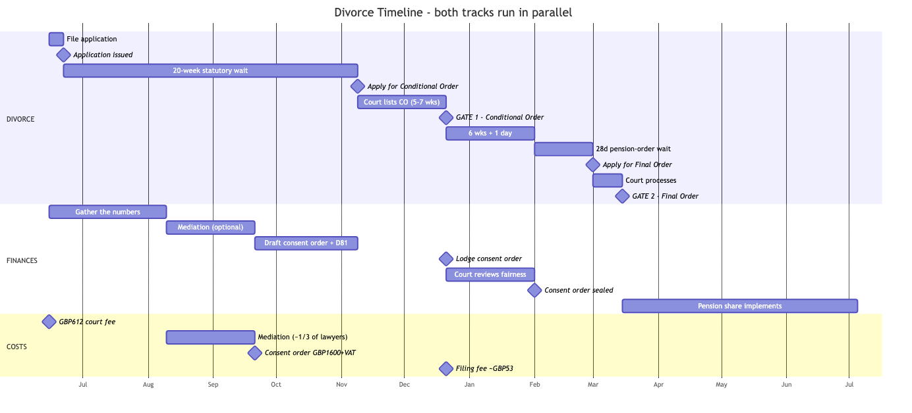

= How to File for Divorce — One-Pager
:doctype: article
:reproducible:
:icons: font
:sectids!:
// Render/print: asciidoctor "How to File for Divorce.adoc"  -> HTML, then print.
// The timeline is a pre-rendered image (how-to-file-divorce-timeline.png) — no extensions needed.

_England & Wales, no-fault. Plain summary for discussion. Not legal advice. Compiled 5 Jun 2026._

== What "filing" actually is

Filing the divorce application is the *opening move* — and it's almost a press-button. It needs *no financial detail, no agreement, and no reason* (no-fault). Filing *starts a 20-week clock*; the money side (gathering figures → mediation → drafting the consent order) all happens *during* those 20 weeks. So filing early just gets the clock ticking — it commits us to nothing about the finances.

The 20 weeks is a *minimum, not a deadline*: you can take as long as you need after it (real-world average ~44 weeks).

== What we need to file

* Both full names (as on the marriage certificate) + both addresses
* Marriage date — 22 Aug 1998
* Marriage certificate — a clean certified copy (ordering a fresh one, ~£11)
* £612 court fee (one fee, whoever applies)
* Tick the box to keep financial claims open (no figures needed — just a placeholder for the consent order later)

== What we do NOT need to file

* Any financial information — asset values, pensions, house valuation, debts
* The consent order (that comes later, inside the 20 weeks)
* Any reason, grounds, or blame

== Sole vs joint (same cost, same timeline, same outcome)

* *Joint* — we apply together on one form; both confirm. Collaborative, but moves at the pace we both act.
* *Sole* — one of us applies; the other simply acknowledges receipt later. Faster to start; still entirely no-fault, no blame.

== Costs to budget for (most are shared)

* *£612* — court fee to file (one-off)
* *Pensions expert (PODE) — ~£2,500–3,500, shared.* An actuary works out a _fair_ pension split (a defined-benefit pension's headline value is misleading, and Heather has one). One jointly-instructed expert, cost split. Lands during the "gathering the numbers" phase.
* *Mediation — budget ~£2,000 total (~£1,000 each):*
** _Does what:_ turns "50/50 in principle" into concrete terms — offsetting, timing of realisation, clean break vs maintenance → produces the MoU the consent order is drafted from
** _Cost:_ MIAM each (~£100pp) + ~3 sessions + MoU; ~⅓ of the solicitor route
** _Provider:_ National Family Mediation (independent / charity — not a government service); mediator is neutral, advises neither side
** _Action:_ contact early, as advised
* *Consent order* — ~£1,600 + VAT to draft it (fixed-fee solicitor), + ~£53 to file
* _(Staying cooperative is what keeps all of these at the low end — a contested route multiplies every one.)_

== The shape of the process

[NOTE]
Two tracks run *in parallel* over the same period: *the divorce* (fixed, can't be contested) and *the finances* (where the actual work is). They meet at two gates. Timeline is *illustrative* — some labels/durations still being refined.

*Reading it:* filing the application (far left) starts everything. We gather numbers and mediate *during* the 20-week wait. *Gate 1 (Conditional Order)* unlocks lodging the financial agreement. *Gate 2 (Final Order)* — the marriage ends — is deliberately held until the financial/pension side is sealed and safe.

'''

_Notes still to firm up: exact mediation cost (per person vs joint), the ~£53 consent-order filing fee, and a few diagram labels. Statutory minimum ~26 weeks; real-world average ~44 weeks._
